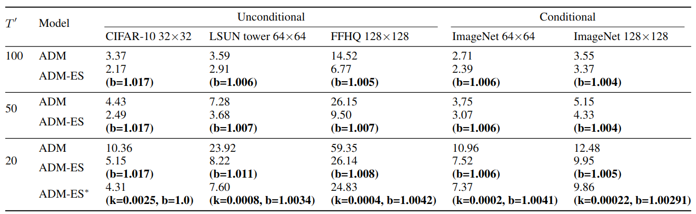
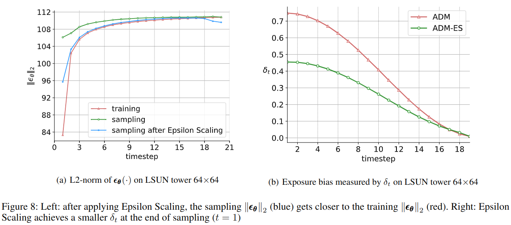

## Elucidating the Exposure Bias in Diffusion Models

This is the codebase for our paper **Elucidating the Exposure Bias in Diffusion Models**
<br>https://arxiv.org/abs/2308.15321


The repository is heavily based on [openai/guided-diffusion](https://github.com/openai/guided-diffusion) with the sampling solution **Epsion Scaling** (ADM-ES) 
<br>Feel free to check out our Epsilon Scaling repository for EDM: [EDM-ES](https://github.com/forever208/EDM-ES) 

## Installation
The installation is the same with [guided-diffusion](https://github.com/openai/guided-diffusion)
```
git clone https://github.com/forever208/DDPM-IP.git
cd DDPM-IP
conda create -n ADM python=3.8
conda activate ADM
pip install -e .
(note that, pytorch 1.10~1.13 is recommended as our experiments in paper were done with pytorch 1.10 and pytorch 2.0 has not been tested by us in this repo)

# install the missing packages
conda install mpi4py
conda install numpy
pip install Pillow
pip install opencv-python
```


## Download ADM base models

We have released checkpoints for the main models in the paper. Before using these models, please review the corresponding [model card](model-card.md) to understand the intended use and limitations of these models.

Here are the download links for each model checkpoint:
* CIFAR-10 32x32: [ADM.pt](https://drive.google.com/file/d/1m-a3WqfpMTibzuTC2om046yWQr20GT0I/view?usp=sharing)
* LSUN tower 64x64: [ADM.pt](https://drive.google.com/file/d/1_7gLg44qP4v5bgJNvSo65MtXDZ3xXW39/view?usp=sharing)
* FFHQ 128x128: [ADM.pt](https://drive.google.com/file/d/1P5Kgyyqp4Zv1RiW116MgBmeX299bGcDw/view?usp=sharing)
* ImageNet 64x64: [ADM.pt](https://openaipublic.blob.core.windows.net/diffusion/jul-2021/64x64_diffusion.pt)
* ImageNet 128x128: [ADM.pt](https://openaipublic.blob.core.windows.net/diffusion/jul-2021/128x128_diffusion.pt)
* ImageNet 128x128 classifier: [ADM-classifier.pt](https://openaipublic.blob.core.windows.net/diffusion/jul-2021/128x128_classifier.pt)


# Sampling by ADM-ES
To sample from these models, you can use the `image_sample.py` for unconditional/conditional sampling or `classifier_sample.py` for classifier guidance sampling 

We provide the full parameters for sampling below. `--eps_scaler=1.0` refers to the ADM baseline.
<br>For the Epsilon Scaling schedule `kt+b`, e set `k=0` as default below, i.e. `eps_scaler=b`.
If you want to try with `kt+b` schedule, uncomment the code in line `176-177` of [gaussian_diffusion.py](./guided_diffusion/gaussian_diffusion.py)

CIFAR-10 (uncond) (1GPU, 100 steps, eps_scaler=1.017, sampling 50k images with batch_size 512):
```shell
mpirun -n 1 python scripts/image_sample.py \
--image_size 32 --timestep_respacing 100 --eps_scaler 1.017 \
--model_path MODEL_PATH \
--num_channels 128 --num_head_channels 32 --num_res_blocks 3 --attention_resolutions 16,8 \
--resblock_updown True --use_new_attention_order True --learn_sigma True --dropout 0.3 \
--diffusion_steps 1000 --noise_schedule cosine --use_scale_shift_norm True --batch_size 512 --num_samples 50000```
```

LSUN tower 64x64 (uncond):
```shell
mpirun -n 1 python scripts/image_sample.py \
--image_size 64 --timestep_respacing 100  --eps_scaler 1.006 \
--model_path MODEL_PATH \
--use_fp16 True --num_channels 192 --num_head_channels 64 --num_res_blocks 3 \
--attention_resolutions 32,16,8 --resblock_updown True --use_new_attention_order True \
--learn_sigma True --dropout 0.1 --diffusion_steps 1000 --noise_schedule cosine --use_scale_shift_norm True \
--rescale_learned_sigmas True --batch_size 256 --num_samples 50000
```

FFHQ 128x128 (uncond):
```shell
mpirun -n 1 python scripts/image_sample.py \
--image_size 128 --timestep_respacing 100 --eps_scaler 1.005 \
--model_path MODEL_PATH \
--use_fp16 True --num_channels 256 --num_head_channels 64 --num_res_blocks 3 \
--attention_resolutions 32,16,8 --resblock_updown True --use_new_attention_order True \
--learn_sigma True --dropout 0.1 --diffusion_steps 1000 --noise_schedule cosine --use_scale_shift_norm True \
--rescale_learned_sigmas True --batch_size 128 --num_samples 50000
```

ImageNet 64x64 (cond)
```shell
mpirun -n 1 python scripts/image_sample.py \
--image_size 64 --timestep_respacing 100 --class_cond True --eps_scaler 1.006 \
--model_path MODEL_PATH \
--use_fp16 True --num_channels 192 --num_head_channels 64 --num_res_blocks 3 \
--attention_resolutions 32,16,8 --resblock_updown True --use_new_attention_order True \
--learn_sigma True --dropout 0.1 --diffusion_steps 1000 --noise_schedule cosine --use_scale_shift_norm True \
--rescale_learned_sigmas True --batch_size 256 --num_samples 50000
```

ImageNet 128x128 (cond with classifier guidance)
```shell
mpirun -n 1 python scripts/classifier_sample.py \
--image_size 128 --timestep_respacing 100 --eps_scaler 1.004 \
--model_path MODEL_PATH \
--classifier_path CLASSIFIER_PATH --classifier_scale 0.5 --class_cond True \
--use_fp16 True --num_channels 256 --num_heads 4 --num_res_blocks 2 \
--attention_resolutions 32,16,8 --resblock_updown True \
--learn_sigma True --diffusion_steps 1000 --noise_schedule linear --use_scale_shift_norm True \
--batch_size 100 --num_samples 50000
```


## Calculating FID
Please refer to [README.md](./evaluations/README.md) for the full instructions


## FID Results
We provide the FID results and parameter settings of `eps_scaler` below

<p align="left">
  
</p>


## Exposure Bias
If you want to compute and plot the **Epsilon L2-norm**, checkout to branch `epsilon_consecutive_sampling` and `epsilon_each_step_sampling`. 

If you want to compute and plot exposure bias metric **delta_t**, checkout to branch `x_t_distribution_consecutive_sampling` and `x_t_distribution_each_step`.

The figure below shows the corresponding results on LSUN tower dataset. 

<p align="left">
  
</p>


## Prepare datasets
Please refer to [README.md](./datasets/README.md) for the detailed data preparation.


## Citation

```
@article{ning2023elucidating,
  title={Elucidating the Exposure Bias in Diffusion Models},
  author={Ning, Mang and Li, Mingxiao and Su, Jianlin and Salah, Albert Ali and Ertugrul, Itir Onal},
  journal={arXiv preprint arXiv:2308.15321},
  year={2023}
}
```

If you want to know our training solution to exposure bias, feel free to check out our ICML 2023 paper and [repository](https://github.com/forever208/DDPM-IP):
```
@article{ning2023input,
  title={Input Perturbation Reduces Exposure Bias in Diffusion Models},
  author={Ning, Mang and Sangineto, Enver and Porrello, Angelo and Calderara, Simone and Cucchiara, Rita},
  journal={arXiv preprint arXiv:2301.11706},
  year={2023}
}
```